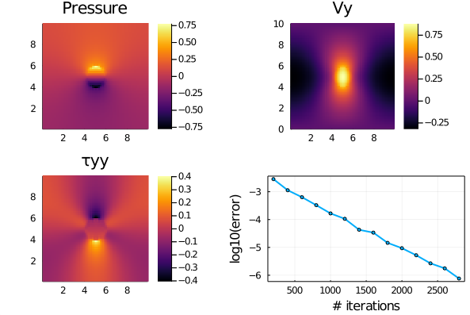

# Stokes2D visco-elastic
Visco-elastic rheology for 2D Stokes solvers. Continuum mechanics.

This repository contains 2D iterative visco-elastic incompressible and single phase Stokes solvers to (1) resolve pressure, velocity and visco-elastic stress distribution around a buoyant ductile spherical inclusion and (2) capture the visco-elastic stress build-up in a homogenous sample.

## Content
* [Julia Codes](#julia-codes)
* [Experiment results](#experiment-results)
* [Extra material](#extra-material)

## Julia codes
The Julia codes implementing 2D Stokes equations and visco-elastic shear rheology:
- [`Stokes2D_ve.jl`](Stokes2D_ve.jl) resolves the buoyant inclusion setup;
- [`Stokes2D_ve_bench.jl`](Stokes2D_ve_bench.jl) captures the visco-elastic stress build-up.

## Experiment results
The rise of a buoyant and ductile inclusion generates, among others, pressure deviation from the hydrostatic gradient, vertical (y) velocity field and vertical normal stress as depcited in the following figure:

The visco-elastic stress buildup benchmark captures stress build up while applying pure shear on a homogenous visco-elastic body. The current non-dimensional configuration is expected to reach a maximal stress level of 2.0 once the elastic build-up is completed, recovering the viscous solution. The figure depicts the horizontal and vertical velocity fields, and the stress build-up curve as function of time, matching the analytical solution (red line):

## Extra material
- A succint [intro to continuum mechanics](docs/intro_continuum_mechanics) as written up by a former colleague from the Uni Lausanne
- Some [slides](visco-elast_schmalholz_unil) from a mechanics course given in Earth sciences at Uni Lausanne by Prof. S. Schmalholz
