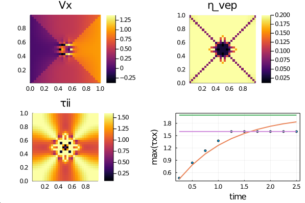
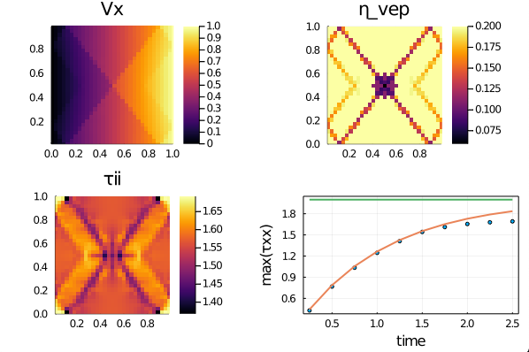
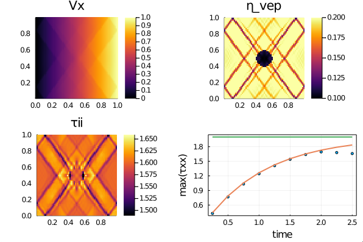
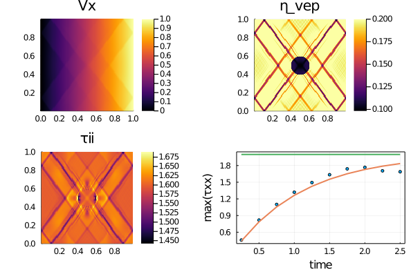
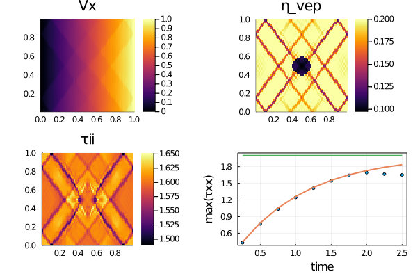
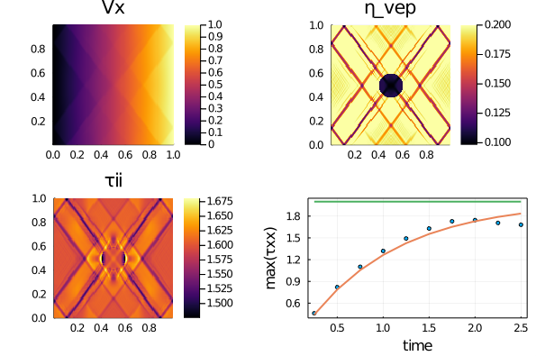
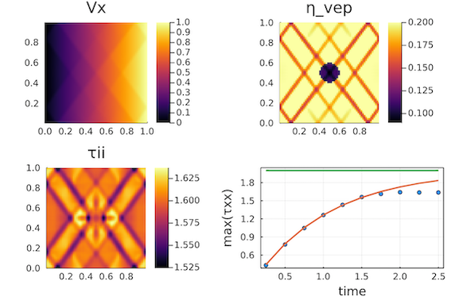
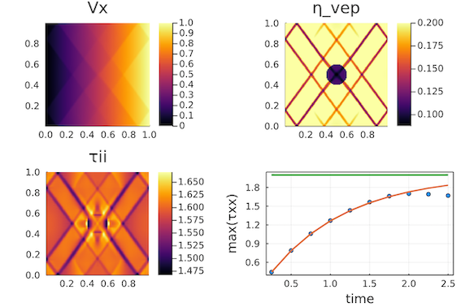

# Concise 2D visco-elasto-plastic Stokes solver

[](https://doi.org/10.5281/zenodo.10212668)

Visco-elasto-plastic rheology for 2D Stokes solvers and continuum mechanics.


This repository contains concise [Julia] 2D iterative visco-elasto-plastic (VEP) incompressible and single phase Stokes solvers to (1) resolve pressure, velocity and visco-elastic stress distribution around a buoyant ductile spherical inclusion, (2) capture the visco-elastic stress build-up in a homogeneous or inclusion sample and (3) adding yielding of the visco-elastic material to resolve visco-elasto-plastic rheology (Von Mises and Drucker-Prager).

⚠️ **Work in progress:**
- The current codes rely on a centres implementation of the VEP rheology (staggered grid). Pure shear configuration results are accurate ([more here](#vertices-centres-formulation)) but simple shear experiments fail to localise compared to vertices only or vertices and centres formulations. More details in the [simpleshear](simpleshear/) folder for the fix.
- The current code rely on a single damping approach (damping the momentum equations - [more here](#new-damping-approach)). A new damping approach may lead to more robust results and further stabilise the iteration count while shear-bands are forming. More details in the [newdamp](newdamp/) folder.

## Content
* [Julia Codes](#julia-codes)
* [Running the codes](#running-the-codes)
* [Experiment results](#experiment-results)
* [Vertices-Centres formulation](#vertices-centres-formulation)
* [Centres `tauxy` formulation](#centres-tauxy-formulation)
* [New damping approach](#new-damping-approach)
* [Extra material](#extra-material)
* [References](#references)

## Julia codes
The Julia codes implementing 2D Stokes equations and visco-elastic or visco-elasto-plastic shear rheology:
- [`Stokes2D_ve_grav.jl`](Stokes2D_ve_grav.jl) resolves a visco-elastic buoyant inclusion setup (1);
- [`Stokes2D_ve_bench.jl`](Stokes2D_ve_bench.jl) captures the visco-elastic stress build-up shearing a homogenous bloc (2);
- [`Stokes2D_ve_pureshear.jl`](Stokes2D_ve_pureshear.jl) captures the visco-elastic stress build-up shearing a visco-elastic inclusion (2);
- [`Stokes2D_vep.jl`](Stokes2D_vep.jl) resolve brittle failure of a bloc containing a visco-elastic inclusion. The `do_DP` switch enable taking friction angle into account (Drucker-Prager instead of Von Mises) (3).
- [`Stokes2D_vep_reg.jl`](Stokes2D_vep_reg.jl) resolve regularised brittle failure of a bloc containing a visco-elastic inclusion. The `do_DP` switch enable taking friction angle into account (Drucker-Prager instead of Von Mises) (3) and the `η_reg` switch sets the regularisation length scale \[[1]\].
- [`Stokes2D_vep_reg_vc.jl`](Stokes2D_vep_reg_vc.jl) is a version of the [`Stokes2D_vep_reg.jl`](Stokes2D_vep_reg.jl) implementation performing the plastic correction on both vertices and centres (vc) on the staggered grid.
- [`Stokes2D_vep_reg_ctau.jl`](Stokes2D_vep_reg_ctau.jl) is a version of the [`Stokes2D_vep_reg.jl`](Stokes2D_vep_reg.jl) implementation performing interpolation of the shear stress `Txy` instead of the vep viscosity `η_vep`.

## Running the codes
To execute the Julia scripts, clone or copy the current repository and launch [Julia] with the `--project` flag. From within the Julia REPL, add the project packages by running `instantiate`. Then execute the Julia scripts `<my_script.jl>` from within the REPL type `include("<my_script.jl>")`:
```julia-repl
julia> ]

(Stokes2D_simpleVEP) pkg> instantiate

julia> include("Stokes2D_vep.jl")
```

## Experiment results

### Visco-elasticity
The rise of a buoyant and ductile inclusion generates, among others, pressure deviation from the hydrostatic gradient, vertical (y) velocity field and vertical normal stress as depicted in the following figure:


The visco-elastic stress build-up benchmark captures stress build up while applying pure shear on a homogeneous visco-elastic body. The current non-dimensional configuration is expected to reach a maximal stress level of 2.0 once the elastic build-up is completed, recovering the viscous solution. The figure depicts the horizontal and vertical velocity fields, and the stress build-up curve as function of time, matching the analytical solution (red line):


Repeating the previous experiment adding an elastically weaker inclusion leads to similar results:


### Visco-elasto-plasticity 🎉
**Von Mises |** Adding an yielding criterion `τ_y` permits to capture brittle or plastic failure of the sample. Minor modification of the solving algorithm are needed to compute the appropriate correction in the predicted stresses to verify the yield function. A shear stress-dependant only yield function leads to Von Mises plasticity. The red, green and purple lines represent the visco-elastic stress build-up, the viscous flow stress and the Von Mises yield stress, respectively:



**Drucker-Prager |** Adding a friction angle (or angel 👼) term `Pt*sin(ϕ)` to the yield function permits to control shear-band orientation and relates to observations from failure patterns in many geo-materials using a Drucker-Prager plasticity model (now assuming that `τ_y` stand for the cohesion term `c*cos(ϕ)`). The red and green lines represent the visco-elastic stress build-up and the viscous flow stress, respectively:



#### Regularisation
**Drucker-Prager |** Adding a viscous regularisation term in parallel to the plastic element \[[1]\] permits to control the shear band width and makes the results resolution independent while stabilising the algorithm.

- Results on a numerical grid resolution of 63x63 grid points:


- Results on a numerical resolution of 127x127 grid points:


## Vertices-Centres formulation
The following results, to be compared to those in the [previous section](#regularisation), are obtained using a vertices and centres formulation of the plastic corrections. The results show comparable patterns:

- Results on a numerical grid resolution of 63x63 grid points:


- Results on a numerical resolution of 127x127 grid points:


## Centres `tauxy` formulation

⚠️ **Simple shear** experiments fail to localise in centres only formulation compared to vertices only or vertices and centres formulations. The solution is to interpolate the shear stress after the plastic correction instead of the effective viscosity. More details in the [simpleshear](simpleshear/) folder.

The following results are based on the code [`Stokes2D_vep_reg_ctau.jl`](Stokes2D_vep_reg_ctau.jl) performing interpolation of the shear stress `Txy` instead of the vep viscosity `η_vep`. Also, the regularisation viscosity `η_reg` is set to `η_reg = 8.0e-3` instead of `η_reg = 1.2e-2` for the other formulation.

- Results on a numerical grid resolution of 63x63 grid points:


- Results on a numerical grid resolution of 127x127 grid points:



## New damping approach
The visco-elast-plastic scripts in the [newdamp](newdamp/) folder contain trials implementations of the new damping approach, using a double damping both on the stress-balance and momentum equations.

## Extra material
The [extras](extras/) folder contains a version of the visco-elasto-plastic code running at higher resolution and producing a [gif](extras/Stokes2D_vep.gif), [`Stokes2D_vep_gif.jl`](extras/Stokes2D_vep_gif.jl).

## References
\[[1]\] Duretz, T., de Borst, R., & Le Pourhiet, L. (2019). Finite thickness of shear bands in frictional viscoplasticity and implications for lithosphere dynamics. Geochemistry, Geophysics, Geosystems, 20, 5598–5616.


[1]: https://doi.org/10.1029/2019GC008531

[Julia]: https://julialang.org
