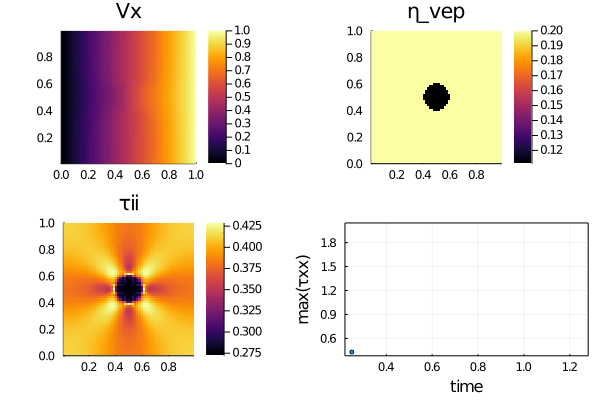

# Concise 2D visco-elasto-plastic Stokes solver
Visco-elasto-plastic rheology for 2D Stokes solvers and continuum mechanics.



This repository contains concise [Julia] 2D iterative visco-elasto-plastic incompressible and single phase Stokes solvers to (1) resolve pressure, velocity and visco-elastic stress distribution around a buoyant ductile spherical inclusion, (2) capture the visco-elastic stress build-up in a homogeneous or inclusion sample and (3) adding yielding of the visco-elastic material to resolve visco-elasto-plastic rheology (Von Mises and Drucker-Prager).

## Content
* [Julia Codes](#julia-codes)
* [Experiment results](#experiment-results)
* [Running the codes](#running-the-codes)
* [Extra material](#extra-material)

## Julia codes
The Julia codes implementing 2D Stokes equations and visco-elastic or visco-elasto-plastic shear rheology:
- [`Stokes2D_ve_grav.jl`](Stokes2D_ve_grav.jl) resolves a visco-elastic buoyant inclusion setup (1);
- [`Stokes2D_ve_bench.jl`](Stokes2D_ve_bench.jl) captures the visco-elastic stress build-up shearing a homogenous bloc (2);
- [`Stokes2D_ve_pureshear.jl`](Stokes2D_ve_pureshear.jl) captures the visco-elastic stress build-up shearing a visco-elastic inclusion (2);
- [`Stokes2D_ve.jl`](Stokes2D_ve.jl) resolve brittle failure of a bloc containing a visco-elastic inclusion. The `do_DP` switch enable taking friction angle into account (Drucker-Prager instead of Von Mises) (3).

## Experiment results

### Visco-elasticity
The rise of a buoyant and ductile inclusion generates, among others, pressure deviation from the hydrostatic gradient, vertical (y) velocity field and vertical normal stress as depicted in the following figure:


The visco-elastic stress build-up benchmark captures stress build up while applying pure shear on a homogeneous visco-elastic body. The current non-dimensional configuration is expected to reach a maximal stress level of 2.0 once the elastic build-up is completed, recovering the viscous solution. The figure depicts the horizontal and vertical velocity fields, and the stress build-up curve as function of time, matching the analytical solution (red line):


Repeating the previous experiment adding an elastically weaker inclusion leads to similar results:


### Visco-elasto-plasticity 🎉
Adding an yielding criterion `τ_y` permits to capture brittle or plastic failure of the sample. Minor modification of the solving algorithm are needed to compute the appropriate correction in the predicted stresses to verify the yield function. A shear stress-dependant only yield function leads to Von Mises plasticity. The red, green and purple lines represent the visco-elastic stress build-up, the viscous flow stress and the Von Mises yield stress, respectively:


Adding a friction angle (or angel 👼) term `Pt*sin(ϕ)` to the yield function permits to control shear-band orientation and relates to observations from failure patterns in many geo-materials using a Drucker-Prager plasticity model. The red and green lines represent the visco-elastic stress build-up and the viscous flow stress, respectively:


## Running the codes
To execute the Julia scripts, clone or copy the current repository and launch [Julia] with the `--project` flag. From within the Julia REPL, add the project packages by running `instantiate`. Then execute the Julia scripts `<my_script.jl>` from within the REPL type `include("<my_script.jl>")`:
```julia-repl
julia> ]

(Stokes2D_simpleVEP) pkg> instantiate

julia> include("Stokes2D_ve_vm.jl")

```

## Extra material
The [extras](extras/) folder contains a version of the visco-elasto-plastic code running at higher resolution and producing a [gif](extras/Stokes2D_vep.gif), [`Stokes2D_vep_gif.jl`](extras/Stokes2D_vep_gif.jl).


[Julia]: https://julialang.org
