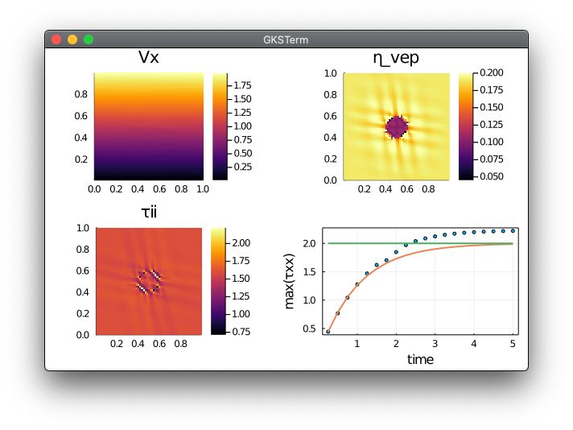
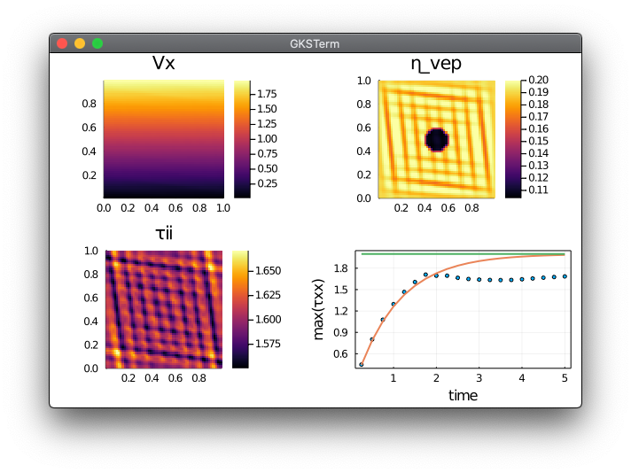
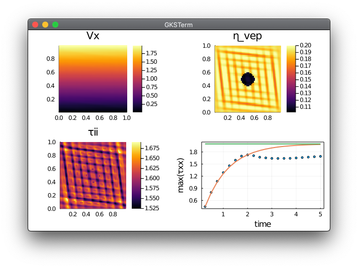
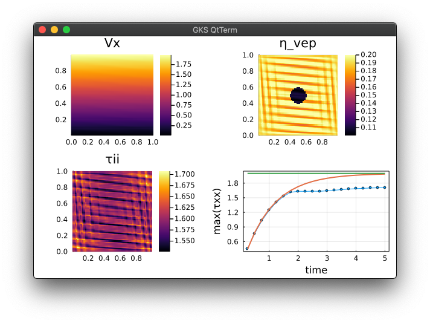

# Concise 2D visco-elasto-plastic Stokes solver
Visco-elasto-plastic rheology for 2D Stokes solvers and continuum mechanics.

👉 **Simple shear:** The current codes rely on a centres implementation of the VEP rheology (staggered grid). Pure shear configuration results are accurate but simple shear experiments fail to localise compared to vertices only or vertices and centres formulations.

## Content
* [The fix](#the-fix)
* [Julia Codes](#julia-codes)

## The fix
Doing the interpolation of the shear stress after the plastic correction:
```julia
Txyv[2:end-1,2:end-1].=av(Txy); Txyv[1,:].=Txyv[2,:]; Txyv[end,:].=Txyv[end-1,:]; Txyv[:,1].=Txyv[:,2]; Txyv[:,end].=Txyv[:,end-1]
```
instead of the visco-elasto-plastic viscosity:
```julia
η_vepv[2:end-1,2:end-1].=av(η_vep); η_vepv[1,:].=η_vepv[2,:]; η_vepv[end,:].=η_vepv[end-1,:]; η_vepv[:,1].=η_vepv[:,2]; η_vepv[:,end].=η_vepv[:,end-1]
Txyv   .= 2.0.*η_vepv.*Exyv1
```
solves the issue.


## Julia codes
The Julia codes implementing 2D Stokes equations and visco-elasto-plastic shear rheology in **simple shear** experiments:
- [`Stokes2D_vep_reg_simpleshear_c.jl`](Stokes2D_vep_reg_simpleshear_c.jl) resolve regularised brittle failure of a bloc containing a visco-elastic inclusion in **centres only** formulation;



- [`Stokes2D_vep_reg_simpleshear_v.jl`](Stokes2D_vep_reg_simpleshear_v.jl) resolve regularised brittle failure of a bloc containing a visco-elastic inclusion in **vertices only** formulation;



- [`Stokes2D_vep_reg_simpleshear_vc.jl`](Stokes2D_vep_reg_simpleshear_vc.jl) resolve regularised brittle failure of a bloc containing a visco-elastic inclusion in **vertices and centres** formulation.



- [`Stokes2D_vep_reg_simpleshear_ctau.jl`](Stokes2D_vep_reg_simpleshear_ctau.jl) resolve regularised brittle failure of a bloc containing a visco-elastic inclusion in **centres** formulation with extrapolation of the corrected shear stress instead of the corrected effective visco-elasto-plastic viscosity.


