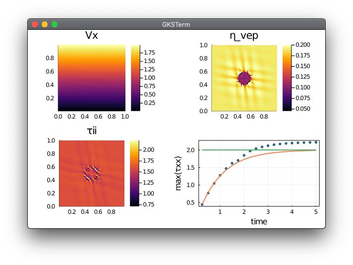
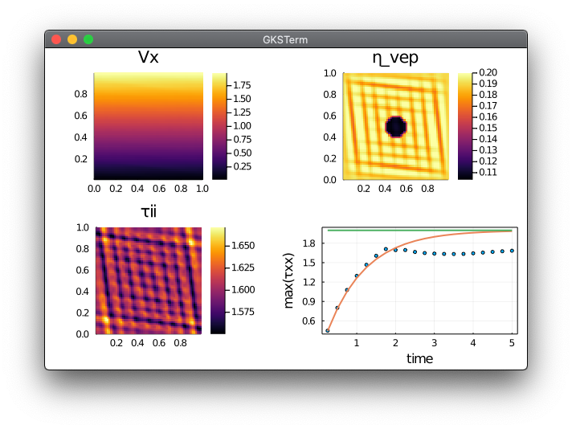
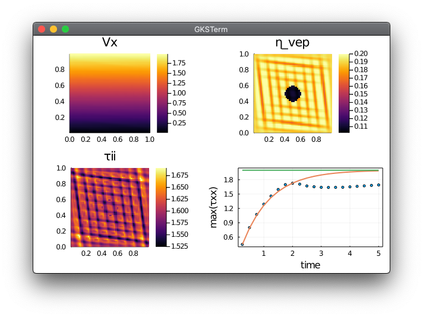
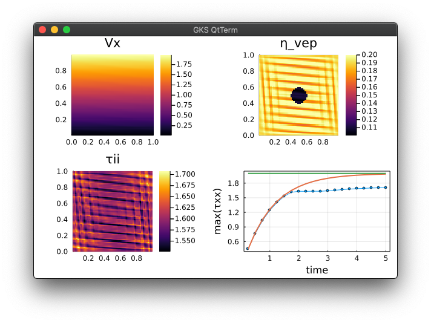

# Concise 2D visco-elasto-plastic Stokes solver
Visco-elasto-plastic rheology for 2D Stokes solvers and continuum mechanics.

⚠️ **Work in progress folder:** The current codes rely on a centres implementation of the VEP rheology (staggered grid). Pure shear configuration results are accurate but simple shear experiments fail to localise compared to vertices only or vertices and centres formulations.

## Content
* [Julia Codes](#julia-codes)
* [Results](#results)

## Julia codes
The Julia codes implementing 2D Stokes equations and visco-elasto-plastic shear rheology in **simple shear** experiments:
- [`Stokes2D_vep_reg_simpleshear_c.jl`](Stokes2D_vep_reg_simpleshear_c.jl) resolve regularised brittle failure of a bloc containing a visco-elastic inclusion in **centres only** formulation;

- [`Stokes2D_vep_reg_simpleshear_v.jl`](Stokes2D_vep_reg_simpleshear_v.jl) resolve regularised brittle failure of a bloc containing a visco-elastic inclusion in **vertices only** formulation;

- [`Stokes2D_vep_reg_simpleshear_vc.jl`](Stokes2D_vep_reg_simpleshear_vc.jl) resolve regularised brittle failure of a bloc containing a visco-elastic inclusion in **vertices and centres** formulation.

- [`Stokes2D_vep_reg_simpleshear_stress.jl`](Stokes2D_vep_reg_simpleshear_stress.jl) resolve regularised brittle failure of a bloc containing a visco-elastic inclusion in **centres** formulation with extrapolation of the corrected shear stress instead of the corrected effective visco-elasto-plastic viscosity.

